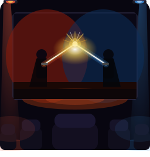

<p align="center">
  
</p>

<h1 align="center">OpenLightFX Studio</h1>

<p align="center">
  A browser-based editor for authoring ambient lighting tracks for home theater.
</p>

<p align="center">
  <a href="LICENSE"></a>
  
  
  
</p>

---

OpenLightFX Studio lets you load a movie, create lighting channels mapped to smart bulbs, and keyframe colors and effects along the timeline. Tracks are exported as `.lightfx` protobuf binary files and played back in real time through the [OpenLightFX Emby plugin](https://github.com/openlightfx/openlightfx-emby).

<!-- TODO: Add screenshot -->

## Features

- **Runs in the browser** — no server required; saves files via the File System Access API
- **Video sync** — load MP4/MKV/WebM with bidirectional timeline↔video sync at 60 fps
- **Canvas timeline** — hardware-accelerated 60 fps rendering supporting 10k+ keyframes with zoom, scroll, and rubber-band selection
- **13 lighting effects** — Static, Breathe, Pulse, Rainbow, Color Cycle, Strobe, Fire, Ocean, Lightning, Candle, Aurora, Sunrise/Sunset, Music Reactive (stub)
- **Channel system** — 6 templates (Basic, Bias, Surround 5.1/7.1, Ambilight, Full RGB) with channel groups supporting Mirror, Spread, and Alternate modes
- **Protocol-agnostic** — tracks are portable across bulb setups; the Emby plugin handles Wiz, Hue, LIFX, and Generic REST at playback time
- **Protobuf format** — industry-standard binary format with built-in validation
- **Undo / redo** — 200-deep command stack, preserved across project saves
- **Auto-save** — localStorage snapshots every 60 seconds
- **Photosensitivity safety** — auto-computed SafetyInfo tracks flash frequency and max brightness delta
- **Scene detection** — histogram-based analysis via Web Worker
- **Lighting overlay** — real-time preview on the video with spatial glow positioning
- **Color tools** — HSL wheel, RGB sliders, hex input, color temperature (1000 K–10 000 K), eyedropper
- **Keyboard shortcuts** — full shortcut system for professional workflow

## Quick Start

```bash
git clone https://github.com/openlightfx/openlightfx-studio.git
cd openlightfx-studio
npm install
npm run dev
# Open http://localhost:5173
```

Requires **Node.js 22+**.

## Docker Development

```bash
docker compose -f docker-compose.dev.yml up dev
# Open http://localhost:5173
```

Compile protobuf bindings inside Docker:

```bash
docker compose -f docker-compose.dev.yml run protoc
```

CI builds (Linux + Windows cross-compile with Wine):

```bash
docker compose -f docker-compose.ci.yml run protoc
docker compose -f docker-compose.ci.yml run build-linux
```

## Available Scripts

| Command | Description |
| --- | --- |
| `npm run dev` | Start SvelteKit dev server |
| `npm run build` | Production build |
| `npm run preview` | Preview production build |
| `npm run check` | Run svelte-check (type checking) |
| `npm run lint` | Run Prettier + ESLint |
| `npm run format` | Auto-format with Prettier |
| `npm run proto:compile` | Regenerate protobuf JS/TS bindings |
| `npm run electron:dev` | Launch Electron + SvelteKit dev server |
| `npm run electron:build` | Production Electron build |

## Architecture

OpenLightFX Studio is a **SvelteKit + Svelte 5** single-page application built with the static adapter (SPA mode). Heavy computation (scene detection, snapshot generation) runs in **Web Workers** to keep the UI thread free. The timeline is entirely **canvas-based** for consistent 60 fps performance even with thousands of keyframes.

### Tech Stack

| Layer | Technology |
| --- | --- |
| Framework | SvelteKit 2.16 / Svelte 5 |
| Language | TypeScript 5 |
| Styling | Tailwind CSS 3.4 |
| Bundler | Vite 6 |
| Serialization | protobufjs 7.4 |
| Runtime | Node.js 22+ |

### Folder Structure

```
src/
├── lib/
│   ├── components/       # Svelte components by domain
│   │   ├── layout/       # AppShell, MenuBar, Toolbar, PanelSplitter
│   │   ├── video/        # VideoPanel, PlaybackControls, LightingOverlay, Eyedropper
│   │   ├── timeline/     # Canvas timeline, interaction, minimap
│   │   ├── properties/   # Context-sensitive property editors
│   │   ├── color/        # Color picker, wheel, sliders, temperature
│   │   ├── channels/     # Channel manager, templates, groups
│   │   ├── effects/      # Effects palette, preview, drop handler
│   │   ├── dialogs/      # Modal dialogs (export, metadata, etc.)
│   │   └── shared/       # Reusable UI primitives
│   ├── stores/           # Svelte 5 rune-based state management
│   ├── services/         # Business logic (protobuf, validation, I/O)
│   ├── effects/          # 13 effect renderers + registry
│   ├── types/            # TypeScript type definitions
│   └── workers/          # Web Workers (scene detection, snapshots)
├── routes/               # SvelteKit routes (SPA)
└── electron/             # Future Electron integration
```

## Track Format

The `.lightfx` format is defined in [`proto/lightfx.proto`](proto/lightfx.proto) using Protocol Buffers v3.

**Channels** are the core abstraction layer — a track defines color and effect keyframes per channel, and the Emby plugin maps channels to physical bulbs at runtime via mapping profiles. This decoupling means a single track works with any bulb setup.

Key concepts:

- **Keyframes** — color, brightness, transition duration, and interpolation mode (Step, Linear, Ease In/Out)
- **Effect keyframes** — dynamic patterns (fire flicker, aurora, etc.) with per-effect parameters
- **Scene markers** — optional markers for organizing long timelines
- **SafetyInfo** — auto-computed metadata for photosensitivity compliance (flash frequency, max brightness delta)

See the proto file for the full schema.

## Related Projects

| Project | Description |
| --- | --- |
| [OpenLightFX Emby Plugin](https://github.com/openlightfx/openlightfx-emby) | Real-time playback engine with bulb discovery and smart bulb drivers |
| [OpenLightFX Marketplace](https://github.com/openlightfx/openlightfx-marketplace) | Community platform for sharing and downloading lighting tracks |

## Contributing

Contributions are welcome! Before submitting a pull request:

```bash
npm run check && npm run lint
```

Please ensure type checking and linting pass cleanly.

## License

[MIT](LICENSE)
